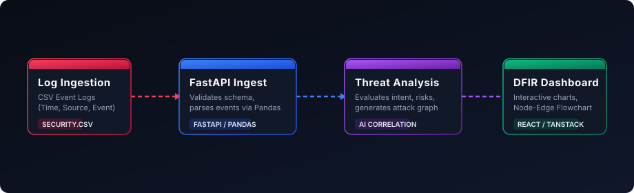
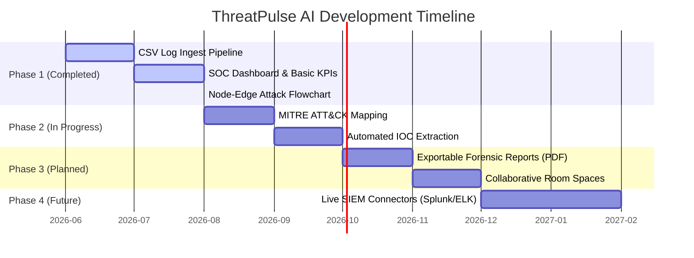

# 🛡️ ThreatPulse AI

[](https://react.dev/)
[](https://www.typescriptlang.org/)
[](https://fastapi.tiangolo.com/)
[](https://www.python.org/)
[](LICENSE)

**ThreatPulse AI** is an AI-powered Digital Forensics and Incident Response (DFIR) dashboard and analysis command center. It accelerates Security Operations Center (SOC) triage by instantly parsing raw security events, identifying threat categories, predicting attacker intent, assessing damages, and reconstructing the execution chain into an interactive, chronological attack path graph.

---

## 🔍 The Problem & The Solution

### The Problem
During a security incident, SOC analysts are overwhelmed with hundreds of raw, unstructured event logs from diverse hosts, firewalls, and endpoint agents. Reconstructing the chronological timeline of an intrusion (from initial access to impact) requires tedious manual correlation, increasing Mean Time to Resolve (MTTR) and leaving critical assets exposed.

### The ThreatPulse Solution
ThreatPulse AI automates the correlation process. By ingesting a simple, chronological log structure, it:
1. **Extracts Evidence**: Groups security events by timestamp and severity.
2. **Scores Risk & Intent**: Uses heuristic scoring to calculate a unified Severity Score and predict the threat actor's ultimate objective.
3. **Maps the Attack Graph**: Generates node-edge visual paths of the intrusion from initial access down to the affected target.
4. **Reconstructs Timelines**: Provides analysts with an interactive, searchable chronological activity log with AI-enriched notes.

---

## ⚙️ Architecture & How It Works

ThreatPulse AI is built on a split monorepo architecture separating the data processing backend from the react state management frontend:



1. **Log Ingestion**: Users upload CSV format security events via the dashboard.
2. **FastAPI Engine**: The Python backend validates schemas and processes logs into structured event lists via Pandas.
3. **AI Threat Correlator**: Scans events chronologically to assess risk levels, determine attacker intent, categorize vectors, and build node-edge metadata.
4. **Interactive UI**: The TanStack Start React frontend displays KPIs, maps flowcharts, lists chronological timelines, and hosts an investigator chat helper.

---

## 🚀 Key Features

- 📊 **Executive SOC Dashboard**: Track total investigations, active incidents, and breakdown counts by severity and monthly frequency.
- 🌲 **Interactive Attack Graph**: Traces the attack chain visually using a customizable React-based Node-Edge graph.
- ⏱️ **Chronological Timeline**: View raw logs with automated severity tagging and integrated forensic evidence descriptions.
- 💬 **Interactive AI Investigator**: Chat interface to ask questions about the current investigation (e.g. "What is the damage done?", "Explain the attacker's intent").
- 📂 **Forensic Evidence Tree**: Explore backend summary JSONs and chronological event structures in a file-explorer style interface.

---

## 🛠️ Implementation & Local Setup

### Prerequisites
Ensure you have the following installed:
- **Python 3.11.x**
- **Node.js 20+** (or Bun)

---

### 1. Backend Setup (FastAPI)

1. Navigate to the root directory.
2. Create and activate a Python virtual environment:
   ```bash
   # Windows (PowerShell)
   python -m venv .venv
   .venv\Scripts\Activate.ps1

   # Linux/macOS
   python3 -m venv .venv
   source .venv/bin/activate
   ```
3. Install dependencies:
   ```bash
   pip install -r requirements.txt
   ```
4. Run the FastAPI development server:
   ```bash
   python run.py
   ```
   The backend will be running at `http://localhost:8000`. You can access the API docs at `http://localhost:8000/docs`.

---

### 2. Frontend Setup (React & Vite)

1. Navigate to the `frontend` directory:
   ```bash
   cd frontend
   ```
2. Install npm dependencies:
   ```bash
   npm install
   ```
3. Start the Vite development server:
   ```bash
   npm run dev
   ```
   The web application will open at `http://localhost:5173`. It is configured to automatically proxy `/api` requests to the local Python server at port `8000`.

---

### 📋 Sample CSV Format
The CSV log file should follow this structure. You can find a sample file at the root named `example.csv`:

```csv
timestamp,source,event,severity
09:31,Email,Phishing email received,High
09:33,Browser,Clicked malicious link,High
09:34,Chrome,Downloaded invoice.exe,Critical
09:35,PowerShell,Encoded command executed,Critical
09:37,Windows,Credential dumping detected,Critical
```

---

## 📅 Project Roadmap



- **Phase 1 (Completed)**: Initial core framework, CSV log parser, AI heuristics engine, interactive chronological timeline, and React flow Node-Edge graph mapping.
- **Phase 2 (In Progress)**: Automated mapping of events directly to **MITRE ATT&CK** techniques and indicators of compromise (IOCs) extraction (IPs, hashes, domain names).
- **Phase 3 (Planned)**: Capability to generate and export audit-ready forensic PDF summaries and support multiple analyst collaborative workspaces.
- **Phase 4 (Future)**: Real-time event streaming integrations directly from SIEM tools (Splunk, ElasticSearch, Microsoft Sentinel).

---

## 📄 License

Distributed under the MIT License. See `LICENSE` for more information.
